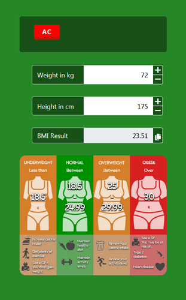
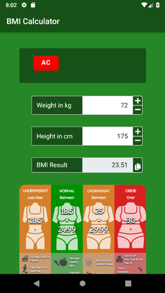
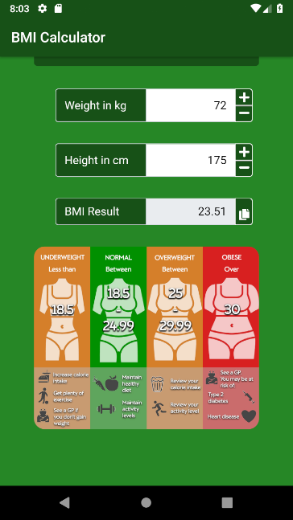
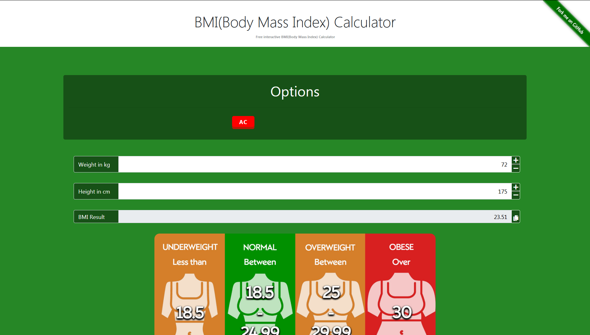
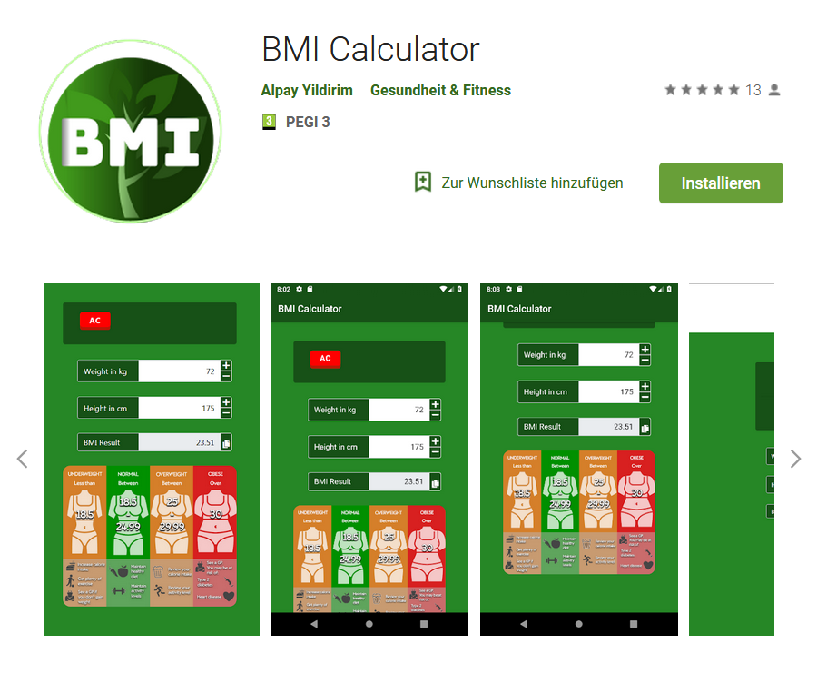

# [📱 BMI (Body Mass Index) Calculator JavaScript 📱](https://ayidouble.github.io/BMI-Calculator-JavaScript/)

**Link** : **[https://ayidouble.github.io/BMI-Calculator-JavaScript/](https://ayidouble.github.io/BMI-Calculator-JavaScript/)** 
**Mobile App** : **[https://github.com/AYIDouble/BMI-Calculator-Android-Java-App](https://github.com/AYIDouble/BMI-Calculator-Android-Java-App)** 
**Official Google Play Store Download Link** : **[https://play.google.com/store/apps/details?id=com.bmicalculator.ayidouble.bmicalculator.app](https://play.google.com/store/apps/details?id=com.bmicalculator.ayidouble.bmicalculator.app)**

A handy **Calculator** to calculate your **BMI (Body Mass Index)**, that works on **all devices**. 📱 💻 🖥

Feel free to use the **Calculator** to calculate your BMI (Body Mass Index).
If you have Suggestions or find Errors, you're free to contact me on GitHub or submit your changes.
The Reason why I build this **Calculator** was, because there wasn't a good one on the Web.
## [📱 Mobile (Smartphone): 📱](https://ayidouble.github.io/BMI-Calculator-JavaScript)

## [💻 Desktop: 🖥](https://ayidouble.github.io/BMI-Calculator-JavaScript)

**[The BMI (Body Mass Index) Calculator is just a Website](https://ayidouble.github.io/BMI-Calculator-JavaScript)** that each possible device can access to. 
## ***You can use the BMI Calculator on your: 📱 💻 🖥***
- ***[Smartphone](https://ayidouble.github.io/BMI-Calculator-JavaScript) (Android/iOS etc.) 📱***
- ***[Tablet](https://ayidouble.github.io/BMI-Calculator-JavaScript) (Chrome, Firefox, Edge, Safari) 📱***
- ***[Laptop](https://ayidouble.github.io/BMI-Calculator-JavaScript) (Chrome, Firefox, Edge, Safari) 💻***
- ***[Desktop](https://ayidouble.github.io/BMI-Calculator-JavaScript) (Chrome, Firefox, Edge, Safari) 🖥***

## [📱 FREE Download Google Play Store: 📱](https://play.google.com/store/apps/details?id=com.bmicalculator.ayidouble.bmicalculator.app)

## As efficient as possible ⚙️

The **Calculator** is designed to give responses on every action,
while you're typing, an algorithm already calculates every number you type and displays the result.
